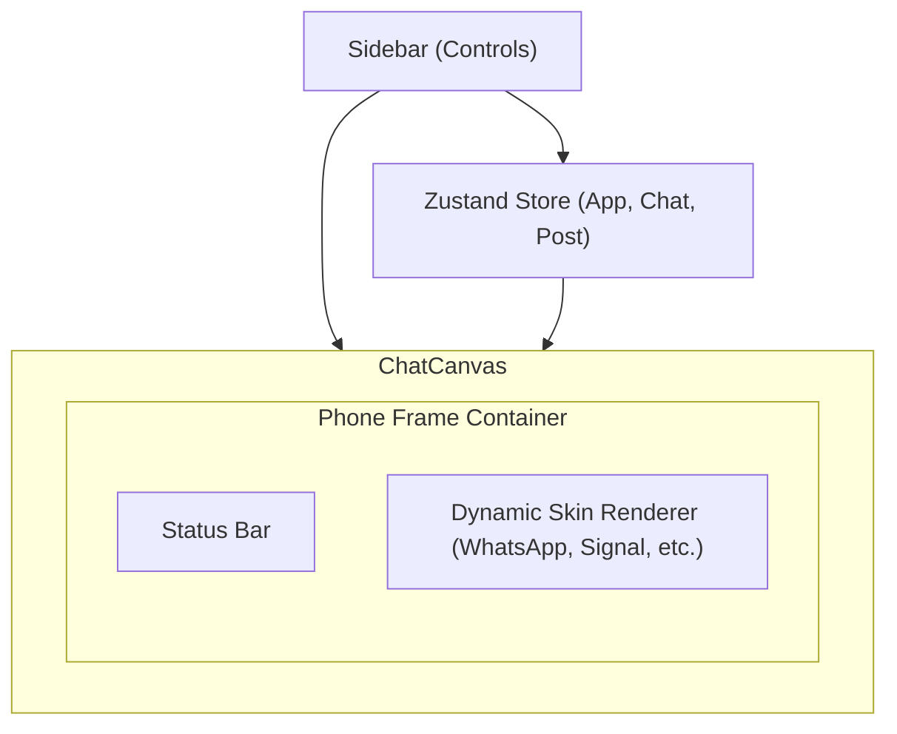

# MockSocial

<div align="center">
  <p><strong>The Ultimate Social Media Mockup Generator.</strong></p>
  <p>Create high-fidelity, stunning chat simulations for WhatsApp, Messenger, Telegram, and more purely in the browser.</p>
</div>

---

## 🚀 What's New (Recent Updates)
* **Next.js 16 & React 19**: Supercharged performance with React Compiler support.
* **Tailwind CSS v4 Engine**: Faster styling with the latest engine.
* **Gemini 2.0 Flash Integration**: Describe a scenario, and AI generates an entire realistic conversation.
* **DB-Free URL Sharing**: Instantly share creations—state is compressed directly into the URL!
* **Native GIF Export**: Create fluid `.gif` sequences natively in the browser.
* **Local Saves**: Snapshot and restore mockups instantly with zero backend.
* **Zustand 5**: Upgraded state management architecture.

## ✨ Key Features
* **Premium & Realistic**: Glassmorphism, dynamic lighting, and pixel-perfect phone chassis (with Dynamic Island).
* **10+ Platforms Supported**: WhatsApp, iMessage, Telegram, Instagram, X (Twitter), Discord, Slack, Teams, and more.
* **Live Visual Editor**: Control status bars (time, battery, WiFi), drag-and-drop messages, add reactions, and upload custom avatars/wallpapers.
* **Smart Autofill ✨**: Instantly populate mockups with realistic, coherent English data using the "Magic Wand" tool.
* **Export Anywhere**: Download high-res PNGs (up to 3x) or fluid animated GIFs.

## 📸 Interface Sneak Peek

<p align="center">
  
  
</p>
<br/>
<p align="center">
  
  
</p>

## 🛠️ Tech Stack


## 🏗️ Architecture



## 💻 Getting Started

```bash
git clone https://github.com/your-repo/mock-social.git
cd mock-social
npm install
cp .env.local.example .env.local # Add GEMINI_API_KEY
npm run dev
```

## ⭐️ Star History

<a href="https://star-history.com/#ashishguleria04/MockSocial&Date">
 <picture>
   <source media="(prefers-color-scheme: dark)" srcset="https://api.star-history.com/svg?repos=ashishguleria04/MockSocial&type=Date&theme=dark" />
   <source media="(prefers-color-scheme: light)" srcset="https://api.star-history.com/svg?repos=ashishguleria04/MockSocial&type=Date" />
   
 </picture>
</a>

## 📄 License

MIT © 2026 MockSocial
