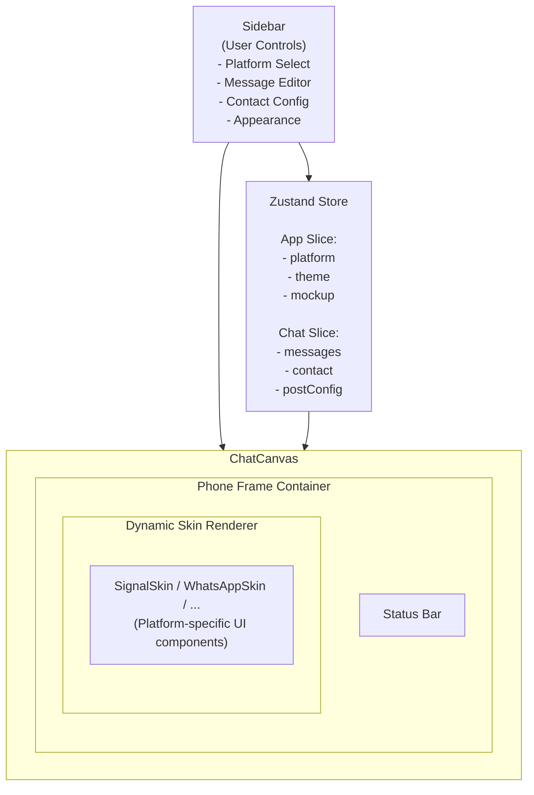

# MockSocial

<div align="center">
  <p><strong>The Ultimate Social Media Mockup Generator.</strong></p>
  <p>Create high-fidelity, stunning chat simulations for WhatsApp, Messenger, Telegram, and more purely in the browser.</p>
</div>

---

## What is New

* **Next.js 16 & React 19**: Supercharged performance leveraging the App Router and React Compiler support for optimized rendering.
* **Tailwind CSS v4 Engine**: Faster styling with the latest engine, providing cleaner utility classes and smaller bundle sizes.
* **Gemini 2.0 Flash Integration**: A powerful AI conversation generator. Describe a scenario in natural language, and the AI generates an entire realistic conversation with platform-aware tone, natural flow, and authentic timestamps.
* **Database-Free URL Sharing**: Instantly share your creations. The entire state of the mockup is compressed directly into a unique URL string, requiring no backend or database.
* **Native GIF Export**: Create fluid `.gif` sequences natively in the browser to showcase scrolling interactions and proof-of-work arrays.
* **Local Saves**: Snapshot and restore mockups instantly using local storage, allowing you to build an internal gallery of templates with zero backend dependencies.
* **Zustand 5 Architecture**: Upgraded, modular state management using sliced stores for better scalability and maintainability.

## Key Features

### Premium Aesthetics
* **Realistic Architecture**: A pixel-perfect smartphone chassis complete with a Dynamic Island, physical hardware buttons, and lifelike shadow rendering.
* **Fluid Interactions**: Powered by Framer Motion, delivering an interface where every interaction, transition, and scale effect feels alive and responsive.
* **Visual Depth**: Enhanced by dynamic background gradients, light/dark modes, and subtle glassmorphism effects for a premium SaaS feel.

### Comprehensive Mockup Tools
* **Broad Platform Support**: Fully implemented, authentic skins for WhatsApp, iMessage, Signal, Slack, Discord, Telegram, Messenger, Instagram, Teams, and X.
* **Live Visual Editor**: Real-time control over the entire phone status bar (time, battery percentage, WiFi, cellular signal), dynamic message drag-and-drop, and custom avatar/wallpaper uploads.
* **Advanced Contexts**: Assign reply-to quotes, link previews, and interactive reaction pills to individual message bubbles for deep conversational realism.
* **Smart Autofill**: Instantly populate your mockup with realistic, coherent English data (messages, profiles, usernames, and posts) using a single click.

## Interface Preview

<p align="center">
  
  
</p>
<br/>
<p align="center">
  
  
</p>

## Tech Stack


## High-Level Architecture



## Project Structure

The codebase is organized to effectively process, render, and manage state for multiple independent social media skins while sharing core components.

```text
src/
├── app/                  # Next.js App Router pages
│   ├── layout.tsx        # Root layout with context providers
│   └── page.tsx          # Main application entry point
├── components/           # React components
│   ├── canvas/           # Rendering engine for the phone
│   │   ├── ChatCanvas.tsx     # Main phone frame wrapper
│   │   ├── StatusBar.tsx      # Dynamic phone status bar
│   │   └── watermark-overlay.tsx
│   ├── shared/           # Reusable UI elements and modals
│   │   ├── ai-chat-dialog.tsx # AI generation interface
│   │   └── icons.tsx          # SVG definitions
│   ├── sidebar/          # User configuration interface
│   │   ├── Sidebar.tsx        # Main controls
│   │   └── SavedMockupsPanel.tsx # Save and restore UI
│   ├── skins/            # Platform-specific UI implementations
│   │   ├── WhatsAppSkin.tsx
│   │   ├── DiscordSkin.tsx
│   │   └── ... 
│   └── ui/               # Shadcn/UI primitive components
├── store/                # Zustand State Management
│   ├── slices/           # Modular data slices
│   │   ├── createAppSlice.ts  # Global theme and platform state
│   │   ├── createChatSlice.ts # Messages and contacts array
│   │   └── createPostSlice.ts # Social post configurations
│   └── useChatStore.ts   # Main store combiner
├── app/api/
│   └── generate-chat/    # Next.js API route for Gemini processing
└── lib/                  # Application utilities
    └── utils.ts
```

## Getting Started

1. **Clone the repository**
   ```bash
   git clone https://github.com/your-repo/mock-social.git
   cd mock-social
   ```

2. **Install dependencies**
   ```bash
   npm install
   ```

3. **Set up environment variables**
   Copy the example environment variables and add your Google Gemini API key to enable the AI conversation generator.
   ```bash
   cp .env.local.example .env.local
   ```
   ```env
   GEMINI_API_KEY="your-gemini-api-key"
   ```

4. **Run Development Server**
   ```bash
   npm run dev
   ```
   Visit `http://localhost:3000` to view the application in your browser.

## Star History

<a href="https://star-history.com/#ashishguleria04/MockSocial&Date">
 <picture>
   <source media="(prefers-color-scheme: dark)" srcset="https://api.star-history.com/svg?repos=ashishguleria04/MockSocial&type=Date&theme=dark" />
   <source media="(prefers-color-scheme: light)" srcset="https://api.star-history.com/svg?repos=ashishguleria04/MockSocial&type=Date" />
   
 </picture>
</a>

## License

MIT © 2026 MockSocial
